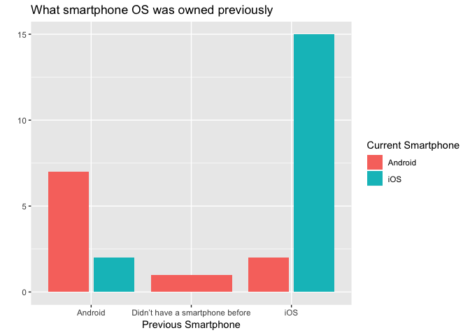
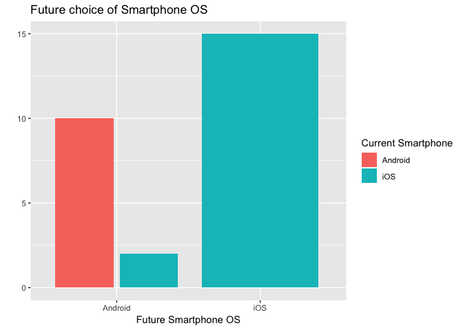
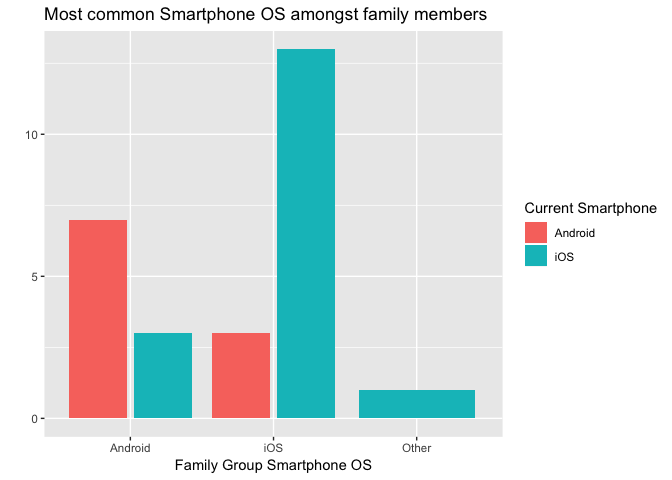
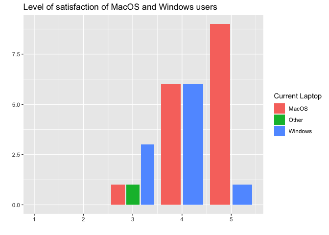
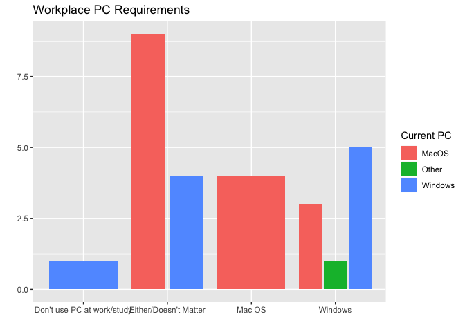

Milestone3 - Report
================

An investigation on the association betwen peoples smartphone choices and their laptop preferences
==================================================================================================

Background
----------

The smartphone operating system industry is dominated by iOS and Android and the laptop operating system industry is dominated by Mac OS and Windows (also Linux, but for the purposes of this investigation it falls under 'Other'), we want to see if having there is any relation between the phones that people own and their PC operating system choices.

Our hypothesis is that the choice of phone will influence the choice of laptop in the individuals. For example, people with an iPhone will have a non-negligible preference for purchasing/owning a Mac, and people with an Android will edge towards a Windows or Linux OS.

Survey Design
-------------

Online Survey Link: <https://form.simplesurvey.com/f/s.aspx?s=ab0d4727-1bfa-492b-a658-603160a2d84f&lang=EN>

The survey is designed to identify the whether the choice of individuals’ smartphone operating systems will influence their choice of laptops. Our main questions are asking respondents what operating systems they use on their smartphones and laptops. Besides of these, we also ask them what their levels of satisfaction with their smartphone and laptop operating systems are on a scale from 1 to 5, where 1 represents “lowest satisfaction” and 5 represents “highest satisfaction”. The rest of questions are all related to our hypothesis and target at finding the cofounding variables.

Considering the ethics problem, our survey questions are based on the UBC Office of Research Ethics document. All online survey data will be stored and accessed in Canada only. In addition, no private information, such as names, IP address, or any information that can indirectly identify someone, will be collected in the survey.

Reading the data
----------------

We asked our respondents a series of questions related to their smartphones and PCs that included their level of satisfaction and the type of OS required at the work. The columns are outlined below

-   **smartphone\_OS**: The type of smartphone that they currently own
-   **num\_smartphone\_OS**: Level of satisfaction with smartphone
-   **smartphone\_OS\_years**: Number of years they've owned the smartphone
-   **pre\_smartphone\_OS**: The smartphone that was owned before the current one
-   **future\_smartphone\_OS**: The smartphone they would purchase today if they had the choice
-   **family\_smartphone\_OS**: The smartphone OS that is most common amongst their family
-   **friend\_smartphone\_OS**: The smartphone OS that is most common amongst their friends
-   **PC\_OS**: The PC/Laptop operating system they are currently running
-   **num\_PC\_OS**: Level of satisfaction with PC
-   **PC\_OS\_years**: How long they've owned their current laptop/PC
-   **future\_PC\_OS**: The PC/Laptop OS they would purchase today if they had the choice
-   **workplace\_PC\_OS**: The PC/Laptop OS that is required by their workplace

Below, we show a snippet of the first six rows of our data, that is read into our analysis pipeline.

| smartphone\_OS |  num\_smartphone\_OS|  smartphone\_OS\_years| pre\_smartphone\_OS | future\_smartphone\_OS | family\_smartphone\_OS | friend\_smartphone\_OS | PC\_OS |  num\_PC\_OS|  PC\_OS\_years| future\_PC\_OS | workplace\_PC\_OS     |
|:---------------|--------------------:|----------------------:|:--------------------|:-----------------------|:-----------------------|:-----------------------|:-------|------------:|--------------:|:---------------|:----------------------|
| iOS            |                    5|                      3| iOS                 | iOS                    | iOS                    | iOS                    | MacOS  |            5|              1| iOS            | Either/Doesn't Matter |
| Android        |                    3|                      3| iOS                 | Android                | iOS                    | iOS                    | MacOS  |            4|              4| iOS            | Windows               |
| iOS            |                    4|                      2| iOS                 | iOS                    | Android                | iOS                    | MacOS  |            4|              1| Other          | Mac OS                |
| iOS            |                    3|                      2| iOS                 | iOS                    | iOS                    | iOS                    | Other  |            3|              1| iOS            | Windows               |
| iOS            |                    4|                      3| iOS                 | iOS                    | iOS                    | iOS                    | MacOS  |            3|              1| iOS            | Either/Doesn't Matter |
| Android        |                    3|                      2| Android             | Android                | Android                | iOS                    | MacOS  |            5|              3| iOS            | Either/Doesn't Matter |

Exploratory Analysis
--------------------

First, let's create some summary tables of the responses to see what kind of a spread we've got.

#### Smartphone OS counts

| Smartphone OS |  Count|
|:--------------|------:|
| Android       |     10|
| iOS           |     17|

#### Laptop OS Counts

| PC OS   |  Count|
|:--------|------:|
| MacOS   |     16|
| Other   |      1|
| Windows |     10|

Now, we decided to look at the **number of combinations between smartphone and PC OS**

| Smartphone OS | PC OS   |  Count|
|:--------------|:--------|------:|
| Android       | MacOS   |      4|
| Android       | Windows |      6|
| iOS           | MacOS   |     12|
| iOS           | Other   |      1|
| iOS           | Windows |      4|

#### Smartphones

Let's take a closer look at the Smartphones category


Looking at the level of satisfaction that iOS users reported



And the level of satisfaction that Android users reported


There appears to be a little more dissatisfaction with their current smartphone OS amongst the Android group. The iOS group on the other hand is robust with their satisfaction with their phones OS; with almost all responses in the 4 or 5 range.

Let's see if this translates into what future phones they might purchase.



Interestingly enough, Android saw a slight increase in the desired smartphone OS category compared to iOS.

#### Laptop OS

Now let's take a closer look at the Laptop OS category


Looking at the level of satisfaction that MacOS users reported out of five,



And the level of satisfaction reported by Windows users



Similarly to the Android group above, the Windows group shows a little bit of a lower satisfaction overall with their current OS than the MacOS group.

#### Combinations of Smartphone,Laptop OS

Finally, looking at a bin2d graph of the current smartphone platforms vs. the current laptop platforms.



Clearly as the iOS, MacOS syndicate is the most represented, it is the lightest on the graph. Our outliers, the cross-platform users, are poorly represented amongst this sample, but still non-negligible.

Statistical Analysis
--------------------

Contingency table for

``` r
(Contingency_smartphone<-table(smart_survey$smartphone_OS,smart_survey$PC_OS))
```

    ##          
    ##           MacOS Other Windows
    ##   Android     4     0       6
    ##   iOS        12     1       4

``` r
(chisq <- chisq.test(Contingency_smartphone))
```

    ## Warning in chisq.test(Contingency_smartphone): Chi-squared approximation
    ## may be incorrect

    ## 
    ##  Pearson's Chi-squared test
    ## 
    ## data:  Contingency_smartphone
    ## X-squared = 3.8435, df = 2, p-value = 0.1463

Conclusion
----------

Based on the visualizations above, we observed that:

1.  Andriod users are little more dissatisfaction with their current smartphone operating system.
2.  iOS users are robust with their current smartphone operating system.
3.  Interestingly, seems like some iOS users are willing to switch to Andriod in the future.
4.  For laptop operating system, the windows users show a little bit of a lower satisfaction overall with their current operation system than the MacOS group.
5.  Just based on the survey results, the combination of iOS smartphone and MacOS laptop is the most represented.

Based on the statistical analysis, we observed that:

With a sample size of 27, the Pearson's Chi-squared test of independance show that there is no significant association between the smartphone choices and laptop preferences with a p-value of 0.1463. The test statistic was 3.8435 with 2 degree of freedom. Base on the contgency table, we see that there is 17 iOS user vs 10 android user. Also, there is 16 MacOS user vs 10 Windows user, and 1 user wih an alternative computer operating system.

Limitations
-----------

The survey still has a number of limitations that we can improve in the future:

-   Due to the survey platform restrictions, it limits the number of responses up to 27. In other words, the dataset is very small for us to come up with a convincing result. As the sample size is a big factor in the chi-square test of independence, our result, there is no association between choice of smartphone os and that of laptop OS, could be more meaningful if we can increase the sample size in the future.
-   Survey respondents are limited to the 2018/19 MDS cohorts who have already been required to have their own laptop with certain hardware requirements before entering to the program. Therefore, the analysis results may be imbalanced between MacOS and Windows operating systems.
-   We should provide more clear descriptions for the satisfaction questions as different persons have various standards to measure the satisfaction levels.

Future Improvements
-------------------

In the future, we may use another survey platform which has no limitation on the number of responses. Additionally, we will expand the survey responding groups instead of focusing on MDS cohorts. We might also include some extreme cases such as elders, low income individuals and etc. Detailed descriptions for each question will also be attached beside of the questions so that the respondents have the opportunities to further understand the standards for each question.
